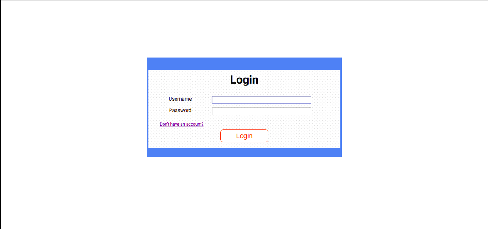
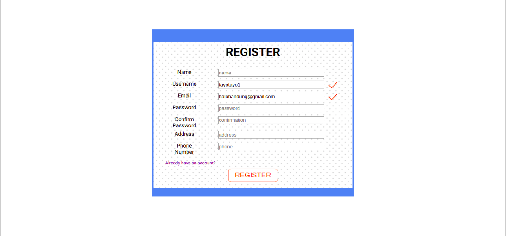
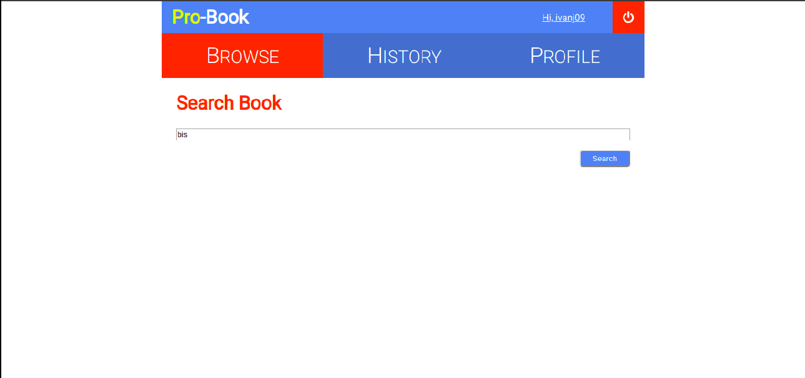
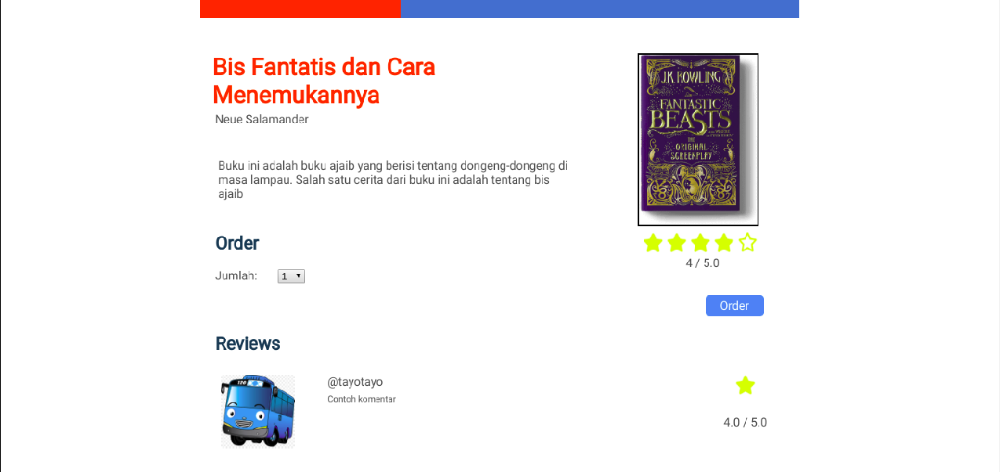
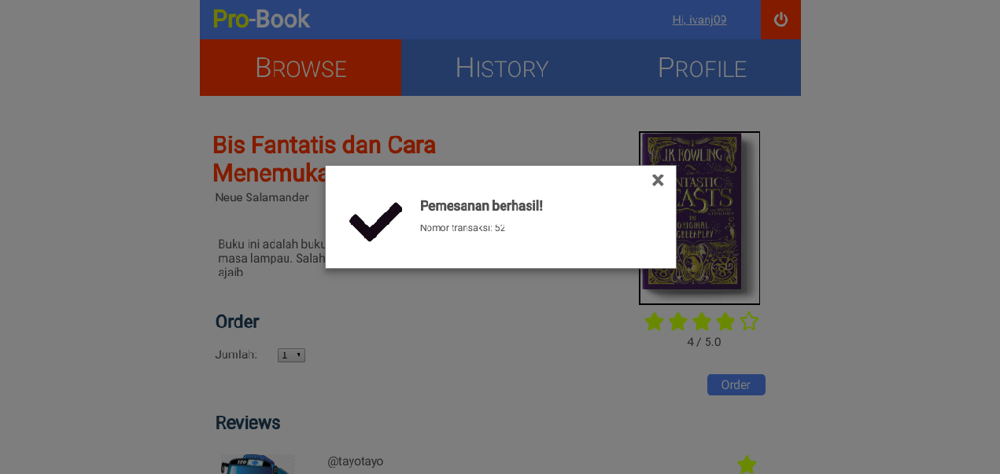
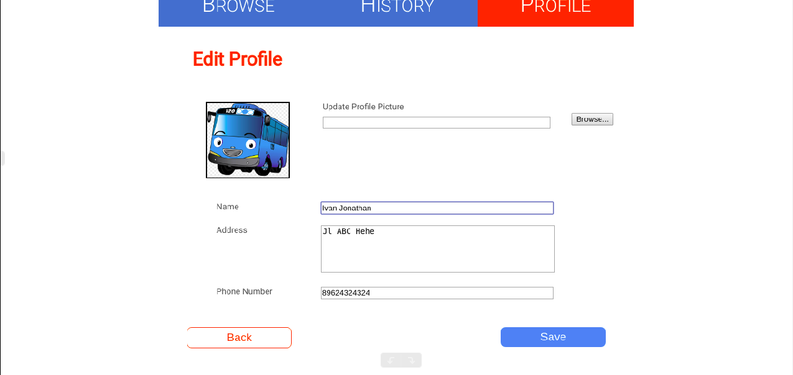
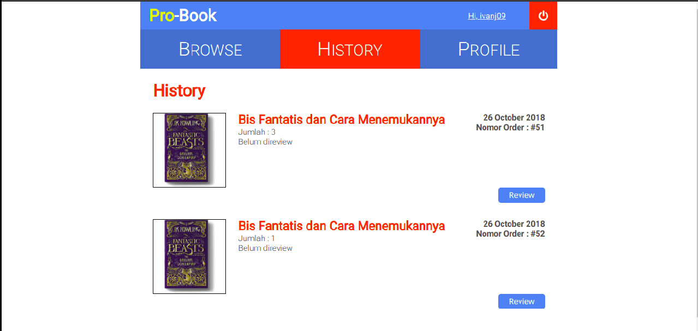
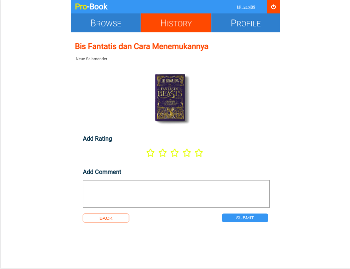

# Tugas 1 IF3110 Pengembangan Aplikasi Berbasis Web
#### Dibuat oleh IF3110-2018-K02-CukupSejam

## Deskripsi Singkat

Suatu aplikasi *toko buku online* **berbasis web** yang memungkinkan seorang pengguna untuk membeli dan memberi komentar pada buku. Aplikasi ini dikembangkan dengan menggunakan membuat *framework* PHP. Sedangkan *tools* pendukung lainnya yaitu Javascript, dan MySQL.

## Pengembang

- **[13516059 - Ivan Jonathan](http://gitlab.informatika.org/ivanj09)**
- **[13516104 - Muhammad Alfian Rasyidin](http://gitlab.informatika.org/malfianrasyidin)**
- **[13516131 - Intan Nurjanah](http://gitlab.informatika.org/intan3951)**

## Dokumentasi

### Login

Pengguna dapat melakukan login sebagai user dengan menggunakan *email* dan *password* yang telah didaftarkan. Jika berhasil login, maka terdapat access_token yang akan disimpan sebagai cookie.

### Register

Pengguna dapat mendaftarkan diri sebagai user agar dapat menggunakan aplikasi ini. Pengguna tidak dapat mendaftarkan diri menggunakan email dan/atau username yang sudah pernah digunakan sebelumnya.

### Search-Books

Search-Books merupakan halaman utama yang ditampilkan ketika user telah login. Pada halaman Search-Books, terdapat sebuah input field dapat diisi pengguna untuk melakukan pencarian buku berdasarkan judul.
Setelah pengguna menekan tombol search, pengguna akan dibawa ke halaman Search-Result.

### Search-Result

Pada Search-Result, ditampilkan daftar buku dan jumlah hasil pencarian. Pada tiap entri buku ditampilkan judul, penulis, gambar, potongan sinopsis, serta rating dari buku tersebut. Jika tombol detail ditekan, pengguna akan dibawa ke halaman Book-Detail dari buku yang bersangkutan.

### Book-Detail

Pada halaman ini, ditampilkan detail buku yang terdiri dari judul, penulis, gambar, rating, serta komentar dan rating dari user lain.

Setelah proses pemesanan selesai dilakukan, akan muncul notifikasi pada browser pengguna.

### Profile

Pada halaman ini, ditampilkan nama lengkap, username, email, alamat, nomor telepon, dan foto profil. Pada bagian kanan atas terdapat tombol edit, jika pengguna menekan tombol tersebut, pengguna dibawa ke halaman Edit-Profile.

### Edit-Profile

Pada halaman ini, pengguna dapat mengubah nama yang ditampilkan, alamat, nomor telepon, dan foto profil.

### History

Pada halaman ini, ditampilkan daftar buku yang sudah pernah dipesan oleh pengguna, diurutkan berdasarkan waktu pemesanan dengan pesanan paling baru merupakan entri paling atas.

Pada tiap entri pada history, terdapat tombol review. Jika tombol review ditekan, pengguna akan dibawa ke halaman Review. Jika pengguna sudah memberikan review untuk order tersebut, tombol review akan hilang dari entri yang bersangkutan.

### Review

Pada halaman ini, pengguna dapat memberikan review untuk buku yang dipesan berupa rating dan komentar. Review yang diberikan dari halaman ini akan muncul pada halaman Book-Detail dari buku yang di-review. Setelah selesai, user akan dibawa kembali ke halaman History.

### Pembagian Tugas

**Tampilan**
1. Login : 13516059
2. Review : 13516059
3. Profile : 13516059, 13516104
4. Register : 13516104
5. Order : 13516104
6. Dashboard : 13516131
7. History : 13516131
8. Search : 13516131

**Fungsionalitas**
1. Login : 13516059
2. Profile : 13516059
3. Review : 13516059
4. Validation : 13516059, 13516104
5. Register : 13516104
6. Framework : 13516104
7. Order : 13516104
8. History : 13516104, 13516131
9. Search : 13516131 